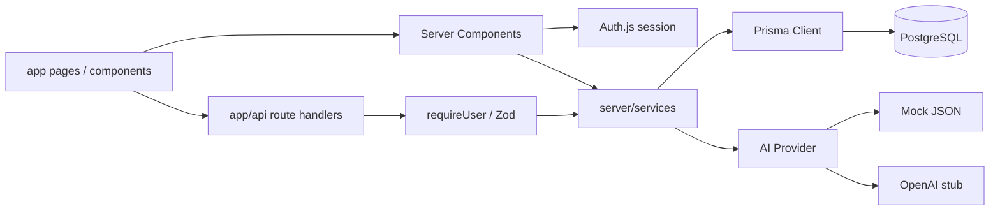

# CareerOS 專案完整結構圖

這份文件說明 CareerOS 的原始碼、設定與產品文件。`node_modules/`、`.next/`、`.git/` 是安裝、建置或版本控制產物，不逐檔列出。

## 先理解路徑符號

- `[locale]`：動態語系路徑，目前是 `en` 或 `zh-TW`。
- `[id]`、`[versionId]`：動態資料 ID。
- `[...nextauth]`：Next.js catch-all route，由 Auth.js 接管多個驗證端點。
- `(auth)`、`(dashboard)`：Route Group，只整理程式，不會出現在網址。
- `page.tsx`：頁面。
- `layout.tsx`：包住子頁面的共用版型。
- `route.ts`：後端 HTTP API。

## 系統資料流



## 完整目錄樹

```text
careerOs/
├─ .env                                 # [本機設定/敏感] 實際環境變數與密鑰，不應提交或公開內容。
├─ .env.example                         # [設定] 環境變數範本：DB、Auth、AI 模式與 OpenAI Key。
├─ .gitignore                           # [設定] Git 忽略規則，排除依賴、建置、環境密鑰等檔案。
├─ README.md                            # [文件] 專案入口說明、快速啟動、技術棧與部署方式。
├─ 01-overview.md                       # [文件] 產品願景、目標使用者、核心功能與產品原則。
├─ 02-frontend.md                       # [文件] 前端頁面、元件、互動與 UI 規格。
├─ 03-backend.md                        # [文件] API、Service、驗證與後端流程規格。
├─ 04-database.md                       # [文件] 資料模型、欄位與關聯設計說明。
├─ 05-architecture.md                   # [文件] 系統分層、AI Provider 與部署架構。
├─ DECISIONS.md                         # [文件] 早期技術與產品決策摘要。
├─ MVP-DECISIONS.md                     # [文件] MVP 最終範圍、限制與實作決策。
├─ testScript.md                        # [文件] 手動測試腳本與主要使用流程檢查清單。
├─ PROJECT-STRUCTURE.md                 # [文件] 本文件，逐層解釋整個程式庫。
├─ project-overview.html                # [視覺文件] 可直接開啟的專案架構與產品導覽網頁。
├─ package.json                         # [設定] npm 指令、執行依賴、開發依賴與 Prisma seed 設定。
├─ package-lock.json                    # [設定] 鎖定完整 npm 套件版本，確保安裝結果一致。
├─ tsconfig.json                        # [設定] TypeScript 編譯規則與 `@/` 路徑別名。
├─ next.config.ts                       # [設定] Next.js 與 next-intl plugin、Server Action 限制。
├─ next-env.d.ts                        # [生成設定] Next.js 自動產生的 TypeScript 型別參照。
├─ tsconfig.tsbuildinfo                 # [生成快取] TypeScript incremental build 資訊，可重新生成。
├─ eslint.config.mjs                    # [設定] ESLint 與 Next.js 程式品質規則。
├─ tailwind.config.ts                   # [設定] Tailwind 掃描路徑、主題色、圓角與動畫設定。
├─ postcss.config.mjs                   # [設定] PostCSS 啟用 Tailwind 與 Autoprefixer。
├─ docker-compose.yml                   # [部署] 啟動本機 PostgreSQL 16、Port 與持久化 Volume。
├─ vercel.json                          # [部署] Vercel 建置與部署相關設定。
│
├─ prisma/
│  ├─ schema.prisma                     # [資料庫] PostgreSQL datasource、20 個 Model、19 個 Enum 與關聯定義。
│  └─ seed.ts                           # [資料庫] 建立 Demo 帳號、技能模板與示範職涯資料。
│
└─ src/
   ├─ auth.ts                           # [Auth] 設定 Credentials Provider、bcrypt 驗證與 Auth.js exports。
   ├─ auth.config.ts                    # [Auth] JWT Session、登入頁與 token/session callback 設定。
   ├─ middleware.ts                     # [Auth/i18n] 語系導向、JWT Cookie 判斷與保護頁面攔截。
   │
   ├─ app/
   │  ├─ globals.css                    # [樣式] Tailwind layers 與全站色彩 CSS variables。
   │  ├─ layout.tsx                     # [畫面] 最外層 HTML/Body、全域 metadata 與 SessionProvider。
   │  ├─ page.tsx                       # [畫面] 根網址依預設語系導向 `/en` 或 `/zh-TW`。
   │  │
   │  ├─ [locale]/
   │  │  ├─ layout.tsx                  # [畫面/i18n] 驗證語系、載入翻譯訊息並提供 Intl Context。
   │  │  ├─ page.tsx                    # [畫面] 公開 Landing Page，介紹產品並連到 Demo/登入/註冊。
   │  │  ├─ demo/page.tsx               # [畫面] 不需登入的 Mock AI 履歷與職缺分析體驗。
   │  │  ├─ onboarding/page.tsx         # [畫面] 四步驟導覽：履歷、目標角色、技能、確認保存。
   │  │  │
   │  │  ├─ (auth)/
   │  │  │  ├─ login/page.tsx           # [畫面] Email/Password 登入並呼叫 Auth.js Credentials。
   │  │  │  └─ register/page.tsx        # [畫面] 建立帳號、自動登入並進入 onboarding。
   │  │  │
   │  │  └─ (dashboard)/
   │  │     ├─ layout.tsx               # [畫面/Auth] Server 端檢查 session，套用 DashboardShell。
   │  │     ├─ dashboard/page.tsx       # [畫面] 工作台總覽：職缺、履歷分數、弱項、學習與面試。
   │  │     ├─ settings/page.tsx        # [畫面] 帳號與系統設定資訊頁。
   │  │     │
   │  │     ├─ career-profile/
   │  │     │  ├─ page.tsx              # [畫面] 顯示職涯檔案、目標角色與使用者技能。
   │  │     │  └─ edit/page.tsx         # [畫面] 編輯基本資料、履歷文字、角色與地點等欄位。
   │  │     │
   │  │     ├─ resume/
   │  │     │  ├─ page.tsx              # [畫面] 履歷功能入口，連到分析、版本與匯出。
   │  │     │  ├─ analyzer/page.tsx     # [畫面] 貼上履歷並顯示 AI 分數、優勢與弱項。
   │  │     │  ├─ export/page.tsx       # [畫面] 選擇履歷版本並下載 PDF。
   │  │     │  └─ versions/
   │  │     │     ├─ page.tsx           # [畫面] 履歷版本清單與新增版本表單。
   │  │     │     └─ [id]/page.tsx      # [畫面] 單一履歷版本內容與下載操作。
   │  │     │
   │  │     ├─ jobs/
   │  │     │  ├─ page.tsx              # [畫面] 職缺追蹤清單、狀態與最近分析分數。
   │  │     │  ├─ new/page.tsx          # [畫面] 新增公司、職稱、JD、地點與工作型態。
   │  │     │  └─ [id]/
   │  │     │     ├─ page.tsx           # [畫面] 職缺詳情、分析、客製履歷與面試準備面板。
   │  │     │     └─ analysis/page.tsx  # [畫面] 完整適配分數、缺失技能、風險與推薦結果。
   │  │     │
   │  │     ├─ learning/
   │  │     │  ├─ page.tsx              # [畫面] 學習首頁、最新 Roadmap、技能階段與優先任務。
   │  │     │  └─ roadmaps/[id]/page.tsx # [畫面] Roadmap 樹、分類任務、筆記與學習資源。
   │  │     │
   │  │     ├─ interview/
   │  │     │  ├─ page.tsx              # [畫面] 面試紀錄清單與新增入口。
   │  │     │  └─ logs/
   │  │     │     ├─ new/page.tsx       # [畫面] 新增公司、階段、表現、卡點與面試題目。
   │  │     │     └─ [id]/page.tsx      # [畫面] 面試詳情、AI 回饋、弱項及 Roadmap 更新結果。
   │  │     │
   │  │     └─ knowledge-base/
   │  │        ├─ page.tsx               # [兼容導向] 舊知識庫入口轉向 Learning。
   │  │        └─ [id]/page.tsx          # [兼容導向] 舊筆記詳情入口轉向 Learning。
   │  │
   │  └─ api/
   │     ├─ auth/
   │     │  ├─ [...nextauth]/route.ts    # [API/Auth] 將 GET/POST 交給 Auth.js handlers。
   │     │  └─ register/route.ts         # [API/Auth] 驗證註冊資料、bcrypt 雜湊並建立 User。
   │     ├─ dashboard/route.ts           # [API] 回傳登入者 Dashboard 統計摘要。
   │     ├─ career-profile/route.ts      # [API] GET/POST/PATCH 讀取或 upsert 職涯檔案。
   │     ├─ skills/templates/route.ts    # [API] 取得指定角色的系統技能模板。
   │     ├─ user-skills/route.ts         # [API] 讀取、加入模板技能或自訂技能。
   │     │
   │     ├─ resume/
   │     │  ├─ analyze/route.ts          # [API/AI] 分析履歷並回寫 Profile AI 摘要與弱項。
   │     │  └─ versions/
   │     │     ├─ route.ts               # [API] GET 履歷版本清單、POST 新增版本。
   │     │     └─ [id]/route.ts          # [API] GET/PATCH/DELETE 單一履歷版本。
   │     │
   │     ├─ jobs/
   │     │  ├─ route.ts                  # [API] GET 職缺清單、POST 建立職缺。
   │     │  └─ [id]/
   │     │     ├─ route.ts               # [API] GET/PATCH/DELETE 單一使用者職缺。
   │     │     ├─ analyze/route.ts       # [API/AI] 執行 JD 適配分析並產生 WeakArea。
   │     │     ├─ tailored-resume/route.ts # [API/AI] 依職缺與個人經歷產生申請內容。
   │     │     └─ interview-prep/route.ts # [API/AI] 依 JD 與語言產生面試準備資料。
   │     │
   │     ├─ learning/
   │     │  ├─ jobs-with-reports/route.ts # [API] 提供可用來生成 Roadmap 的已分析職缺。
   │     │  ├─ roadmaps/route.ts         # [API] 取得登入者所有學習 Roadmap。
   │     │  ├─ roadmaps/generate/route.ts # [API/AI] 建立職涯或職缺導向 Roadmap。
   │     │  ├─ roadmaps/[id]/route.ts    # [API] 取得單一 Roadmap 與任務。
   │     │  └─ tasks/[id]/route.ts       # [API] 更新任務狀態或學習筆記。
   │     │
   │     ├─ interview/
   │     │  └─ logs/
   │     │     ├─ route.ts               # [API] GET 面試清單、POST 建立面試紀錄。
   │     │     └─ [id]/
   │     │        ├─ route.ts            # [API] 取得單一面試紀錄與問題。
   │     │        └─ analyze/route.ts    # [API/AI] 分析面試、更新弱項與 Roadmap。
   │     │
   │     ├─ knowledge-base/
   │     │  └─ notes/
   │     │     ├─ route.ts               # [API] 舊 KnowledgeNote 清單與建立功能。
   │     │     └─ [id]/route.ts          # [API] 舊 KnowledgeNote 讀取、修改與刪除。
   │     │
   │     ├─ export/resume/[versionId]/
   │     │  ├─ pdf/route.ts              # [API/匯出] 將履歷版本渲染成 PDF Buffer 下載。
   │     │  └─ markdown/route.ts         # [API/匯出] 將履歷版本以 Markdown 檔案下載。
   │     │
   │     └─ demo/
   │        ├─ resume/analyze/route.ts   # [公開 API] 不登入也能取得 Mock 履歷分析。
   │        └─ job-fit/route.ts          # [公開 API] 不登入也能取得 Mock 職缺適配分析。
   │
   ├─ components/
   │  ├─ layout/
   │  │  ├─ dashboard-shell.tsx          # [版型] 組合 Sidebar、Header 與主內容區。
   │  │  ├─ header.tsx                   # [元件] 使用者名稱、語系切換與登出按鈕。
   │  │  └─ sidebar.tsx                  # [元件] Dashboard 主選單與目前路徑高亮。
   │  ├─ providers/
   │  │  └─ session-provider.tsx         # [Provider] 將 Auth.js Session Context 提供給 Client Components。
   │  ├─ shared/
   │  │  ├─ empty-state.tsx              # [元件] 清單無資料時的圖示、文字與 CTA。
   │  │  ├─ html-lang.tsx                # [i18n] 在 Client 端同步 `<html lang>`。
   │  │  ├─ locale-switcher.tsx          # [i18n] 保留目前路徑並切換 en/zh-TW。
   │  │  └─ output-language-select.tsx   # [元件] 選擇 AI 輸出英文、繁中或雙語。
   │  ├─ interview/
   │  │  └─ analyze-button.tsx           # [互動] 呼叫面試分析 API 並刷新結果頁。
   │  ├─ jobs/
   │  │  ├─ job-actions.tsx              # [互動] 觸發職缺分析、狀態更新或刪除。
   │  │  ├─ interview-prep-panel.tsx     # [互動/畫面] 生成並呈現 JD 面試準備內容。
   │  │  └─ tailored-resume-panel.tsx    # [互動/畫面] 生成、解析與顯示客製申請內容。
   │  ├─ knowledge/
   │  │  └─ create-note-form.tsx         # [舊元件] 建立 KnowledgeNote 的表單，目前主 UI 已轉向 Learning。
   │  ├─ resume/
   │  │  └─ create-version-form.tsx      # [互動] 建立新的履歷名稱、語言與內容版本。
   │  ├─ learning/
   │  │  ├─ copy-button.tsx              # [互動] 複製學習 Prompt 並顯示完成狀態。
   │  │  ├─ generate-roadmap-form.tsx    # [互動] 選擇方向、職缺、語言並生成 Roadmap。
   │  │  ├─ generate-roadmap-from-job-button.tsx # [互動] 從分析頁直接建立職缺 Roadmap。
   │  │  ├─ learning-prompt-library.tsx  # [畫面] 顯示理解、實作、除錯與面試 Prompt。
   │  │  ├─ priority-skill-cards.tsx     # [畫面] 呈現最高優先的學習技能卡。
   │  │  ├─ roadmap-tree.tsx             # [畫面] 可展開/收合的階層式 Roadmap 樹。
   │  │  ├─ skill-stage-card.tsx         # [畫面] 顯示使用者目前技能階段判斷。
   │  │  ├─ task-learning-resources.tsx  # [畫面] 解析並組合練習、問題與 Prompt 資源。
   │  │  ├─ task-note-editor.tsx         # [互動] 新增、更新或移除任務筆記。
   │  │  └─ task-status-button.tsx       # [互動] 切換未開始、進行中、完成或略過。
   │  └─ ui/
   │     ├─ badge.tsx                    # [基礎 UI] 可套用狀態色的 Badge。
   │     ├─ button.tsx                   # [基礎 UI] 支援 variant、size 與 Slot 的 Button。
   │     ├─ card.tsx                     # [基礎 UI] Card、Header、Title、Description、Content 組件。
   │     ├─ input.tsx                    # [基礎 UI] 共用文字輸入框樣式。
   │     ├─ label.tsx                    # [基礎 UI] 基於 Radix Label 的表單標籤。
   │     ├─ select.tsx                   # [基礎 UI] 基於 Radix Select 的下拉選單組件。
   │     ├─ tabs.tsx                     # [基礎 UI] 基於 Radix Tabs 的分頁切換組件。
   │     └─ textarea.tsx                 # [基礎 UI] 共用多行文字輸入框。
   │
   ├─ server/
   │  ├─ auth/
   │  │  └─ require-user.ts              # [安全] API 共用 guard，無 session.user.id 時回傳 401。
   │  ├─ ai/
   │  │  ├─ ai-provider.interface.ts     # [AI 抽象] 定義結構化請求與 Provider 統一介面。
   │  │  ├─ ai-client.ts                 # [AI 工廠] 依 AI_MODE 建立並快取 Mock/OpenAI Provider。
   │  │  ├─ rate-limit.ts                # [AI 安全] 檢查每日配額並記錄 AIRequestLog。
   │  │  ├─ prompts/
   │  │  │  └─ tailored-resume.prompt.ts # [AI Prompt] 組合客製履歷 system/user prompt。
   │  │  ├─ providers/
   │  │  │  ├─ mock.provider.ts          # [AI 實作] 讀取 demo-data，依 action 回傳穩定假資料。
   │  │  │  └─ openai.provider.ts        # [AI 實作] OpenAI 預留 adapter，目前仍 fallback 到 Mock。
   │  │  └─ schemas/
   │  │     ├─ tailored-resume.schema.ts # [AI Schema] 重新匯出共用客製履歷 Schema 與型別。
   │  │     ├─ learning-roadmap.ts       # [AI Schema] 驗證 Roadmap、Tree、Task 與 Prompt 結構。
   │  │     └─ interview-roadmap-update.ts # [AI Schema] 驗證提高優先度或新增任務指令。
   │  └─ services/
   │     ├─ career-profile.service.ts    # [商業邏輯] 取得與 upsert 使用者 CareerProfile。
   │     ├─ dashboard.service.ts         # [商業邏輯] 聚合職缺、履歷、弱項、Roadmap 與面試統計。
   │     ├─ export.service.ts            # [商業邏輯] 使用 react-pdf 將文字渲染為 PDF。
   │     ├─ interview.service.ts         # [商業邏輯/AI] 面試 CRUD、回饋分析、WeakArea 與 Roadmap 更新。
   │     ├─ job.service.ts               # [商業邏輯/AI] 職缺 CRUD、適配分析、客製履歷與面試準備。
   │     ├─ knowledge-base.service.ts    # [商業邏輯] 舊 KnowledgeNote CRUD，保留 API 相容性。
   │     ├─ learning.service.ts          # [商業邏輯/AI] Roadmap 生成、任務排序、狀態與面試回寫。
   │     ├─ learning-context.ts          # [上下文] 聚合 Profile、技能、職缺報告與弱項供 AI 使用。
   │     ├─ resume.service.ts            # [商業邏輯/AI] 履歷分析、版本 CRUD 與 AI Request 記錄。
   │     ├─ skill.service.ts             # [商業邏輯] 技能模板、使用者技能與自訂技能管理。
   │     ├─ skill-stage-rules.ts         # [規則] Mock 模式根據技能組合推導學習階段提示。
   │     └─ tailored-resume-context.ts   # [上下文] 聚合 JD、履歷、Profile、技能與輸出語言。
   │
   ├─ lib/
   │  ├─ api-error.ts                    # [工具] 統一成功與錯誤 API Response 格式。
   │  ├─ db.ts                           # [資料庫] 建立/快取 PrismaClient，避免開發 HMR 連線暴增。
   │  ├─ env.ts                          # [設定] 用 Zod 解析 DATABASE_URL、Auth 與 AI 環境變數。
   │  ├─ utils.ts                        # [工具] 合併 Tailwind class 與格式化日期。
   │  ├─ enum-labels.ts                  # [i18n 工具] 將 Prisma Enum 轉成翻譯標籤。
   │  ├─ output-language.ts              # [AI 工具] 定義 EN/ZH_TW/BILINGUAL Schema、型別與選項。
   │  ├─ detect-job-language.ts          # [文字工具] 根據中英文比例判斷 JD 語言。
   │  ├─ parse-json-arrays.ts            # [資料工具] 安全地把未知 JSON 解析為字串陣列。
   │  ├─ tailored-resume-schema.ts       # [驗證] 客製申請信、重點與技能結果的 Zod Schema。
   │  └─ tailored-resume-markdown.ts     # [輸出] 將客製申請內容轉成 Markdown。
   │
   ├─ i18n/
   │  ├─ routing.ts                      # [i18n] 定義支援語系、預設語系與 URL 策略。
   │  ├─ request.ts                      # [i18n] 每次請求載入對應 messages JSON。
   │  └─ navigation.ts                   # [i18n] 產生帶語系的 Link、router、redirect helpers。
   │
   ├─ messages/
   │  ├─ en.json                         # [翻譯] 英文 UI、狀態、錯誤與產品文字。
   │  └─ zh-TW.json                      # [翻譯] 繁體中文 UI、狀態、錯誤與產品文字。
   │
   ├─ demo-data/
   │  ├─ resume-analysis.json            # [Mock 資料] 履歷評分、優勢、弱項與建議。
   │  ├─ job-fit-analysis.json           # [Mock 資料] 職缺適配分數、缺口、風險與推薦。
   │  ├─ tailored-resume.json            # [Mock 資料] 雙語申請信、亮點與技能對應。
   │  ├─ learning-roadmap.json           # [Mock 資料] Roadmap 摘要、樹、任務與練習內容。
   │  ├─ interview-prep.json             # [Mock 資料] 面試主題、問題與準備方向。
   │  └─ interview-feedback.json         # [Mock 資料] 面試摘要、弱項、練習與 Roadmap 更新。
   │
   └─ types/
      └─ next-auth.d.ts                  # [型別擴充] 在 Session.user 與 JWT 加入 user id。
```

## 功能如何跨資料夾連起來

### 職缺分析

```text
jobs/[id]/page.tsx
→ JobActions
→ POST /api/jobs/[id]/analyze
→ requireUser
→ JobService.analyzeFit
→ AIProvider
→ JobAnalysisReport + WeakArea
→ 分析頁重新顯示結果
```

### 學習 Roadmap

```text
GenerateRoadmapForm
→ POST /api/learning/roadmaps/generate
→ LearningContextBuilder
→ LearningService.generate
→ AIProvider + Zod schema
→ LearningRoadmap + LearningTask
→ learning/roadmaps/[id]/page.tsx
```

### 面試回饋閉環

```text
InterviewLog detail
→ POST /api/interview/logs/[id]/analyze
→ InterviewService.analyzeFeedback
→ AIProvider
→ WeakArea
→ LearningService.applyInterviewRoadmapUpdates
→ 提高任務優先度或加入新任務
```

### 身分與資料權限

```text
Credentials + bcrypt
→ Auth.js JWT Cookie
→ middleware / dashboard layout
→ requireUser()
→ Service 查詢同時使用 resource id + userId
→ Prisma / PostgreSQL
```

## 不屬於原始碼的資料夾

- `node_modules/`：npm 安裝的第三方套件，不應手動修改。
- `.next/`：Next.js 開發或建置產物，可重新生成。
- `.git/`：Git commit、branch 與物件資料庫。
